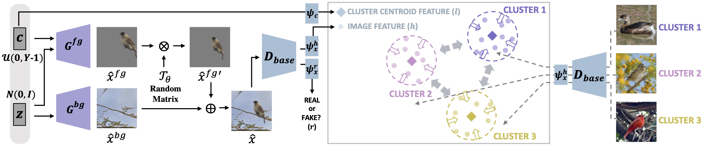
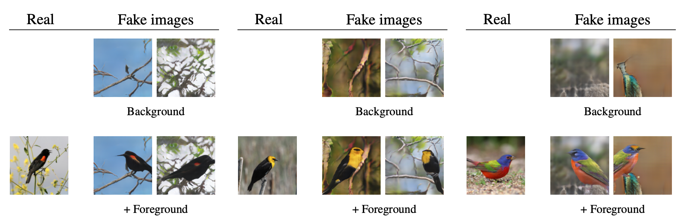
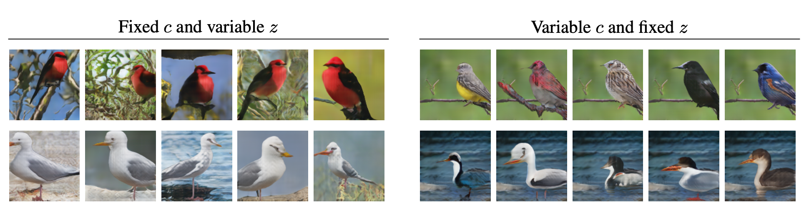

### Official pytorch implemenation of C3-GAN
---

<p align="center">
  </img>
</p>

> #### Contrastive Fine-grained Class Clustering via Generative Adversarial Networks [[Paper](https://arxiv.org/abs/2112.14971)]<br>
> #### Authors: [Yunji Kim](https://github.com/YunjiKim), [Jung-Woo Ha](https://github.com/jungwoo-ha) 

#### Abstract
Unsupervised fine-grained class clustering is practical yet challenging task due to the difficulty of feature representations learning of subtle object details.
We introduce C3-GAN, a method that leverages the categorical inference power of InfoGAN by applying contrastive learning. We aim to learn feature representations that encourage the data to form distinct cluster boundaries in the embedding space, while also maximizing the mutual information between the latent code and its observation. Our approach is to train the discriminator, which is used for inferring clusters, to optimize the contrastive loss, where the image-latent pairs that maximize the mutual information are considered as positive pairs and the rest as negative pairs. Specifically, we map the input of the generator, which was sampled from the categorical distribution, to the embedding space of the discriminator and let them act as a cluster centroid. In this way, C3-GAN achieved to learn a clustering-friendly embedding space where each cluster is distinctively separable. Experimental results show that C3-GAN achieved state-of-the-art clustering performance on four fine-grained benchmark datasets, while also alleviating the mode collapse phenomenon.


----
### I. To do list before you run the code

The initial code is optimized for [CUB](http://www.vision.caltech.edu/visipedia/CUB-200-2011.html) dataset. :owl: :parrot: :swan: :eagle: :duck:
You may have to adjust few things for running this code on another datasets. Please refer to descriptions below.

#### ※ Hyperparameters setting
You can adjust various hyperparemeters' values such as the number of clusters, the degree of perturbation, etc. in [config.py](https://github.com/naver-ai/c3-gan/blob/main/config.py) file.

#### ※ Annotate data for evaluation
It is required to annotate each image with its ground truth class label for evaluating Accuracy (ACC) and Normalized Mutual Information (NMI) scores.
The class information should be represented in the *int* format.
Please check out [sample files](https://github.com/naver-ai/c3-gan/blob/main/data/cub/trainset.txt) in data/cub.
You may also have to adjust [datasets.py](https://github.com/naver-ai/c3-gan/blob/main/datasets.py) file depending on where you saved the image files and how you made the annotation files.

----
### II. Train
If you have set every arguments in [config.py](https://github.com/naver-ai/c3-gan/blob/main/config.py) file, the training code would be run with the simple command below.
```
python train.py
```

#### ※ Pre-trained model for [CUB](https://drive.google.com/file/d/1vNL0SqOfI0D8qG0K23SJdYs2aK11ugMO/view?usp=sharing)
For loading the parameters of the pre-trained model, please adjust the value of cfg.OVER to '2' and set cfg.MODEL_PATH to wherever you saved the file.

---
### III. Results

#### ※ Fine-grained Class Clustering Results

<table>
  <tr>
    <td> </td>
    <td colspan="4" align="center">Acc</td>
    <td colspan="4" align="center">NMI</td>
  </tr>
  <tr>
    <td> </td>
    <td>Bird</td>
    <td>Car</td>
    <td>Dog</td>
    <td>Flower</td>
    <td>Bird</td>
    <td>Car</td>
    <td>Dog</td>
    <td>Flower</td>
  </tr>
  <tr>
    <td> IIC </td>
    <td>7.4</td>
    <td>4.9</td>
    <td>5.0</td>
    <td>8.7</td>
    <td>0.36</td>
    <td>0.27</td>
    <td>0.18</td>
    <td>0.24</td>
  </tr>
  <tr>
    <td> SimCLR + k-Means </td>
    <td>8.4</td>
    <td>6.7</td>
    <td>6.8</td>
    <td>12.5</td>
    <td>0.40</td>
    <td>0.33</td>
    <td>0.19</td>
    <td>0.29</td>
  </tr>
  <tr>
    <td> InfoGAN </td>
    <td>8.6</td>
    <td>6.5</td>
    <td>6.4</td>
    <td>23.2</td>
    <td>0.39</td>
    <td>0.31</td>
    <td>0.21</td>
    <td>0.44</td>
  </tr>
  <tr>
    <td> FineGAN </td>
    <td>6.9</td>
    <td>6.8</td>
    <td>6.0</td>
    <td>8.1</td>
    <td>0.37</td>
    <td>0.33</td>
    <td>0.22</td>
    <td>0.24</td>
  </tr>
  <tr>
    <td> MixNMatch </td>
    <td>10.2</td>
    <td>7.3</td>
    <td>10.3</td>
    <td>39.0</td>
    <td>0.41</td>
    <td>0.34</td>
    <td>0.30</td>
    <td>0.57</td>
  </tr>
  <tr>
    <td> SCAN </td>
    <td>11.9</td>
    <td>8.8</td>
    <td>12.3</td>
    <td>56.5</td>
    <td>0.45</td>
    <td>0.38</td>
    <td>0.35</td>
    <td><b>0.77</b></td>
  </tr>
  <tr>
    <td><b>C3-GAN</b></td>
    <td><b>27.6</b></td>
    <td><b>14.1</b></td>
    <td><b>17.9</b></td>
    <td><b>67.8</b></td>
    <td><b>0.53</b></td>
    <td><b>0.41</b></td>
    <td><b>0.36</b></td>
    <td>0.67</td>
  </tr>
</table>


#### ※  Image Generation Results

>##### Conditional Generation 
><sup>*Images synthesized with the predicted cluster indices of given real images.*</sup>
<p align="center">
  </img>
</p>

>##### Random Generation
><sup>*Images synthesized by random value sampling of the latent code c and noise variable z.*</sup>
<p align="center">
  </img>
</p>

---

#### ※※ bibtex
```
@article{kim2021c3gan,
  title={Contrastive Fine-grained Class Clustering via Generative Adversarial Networks},
  author={Kim, Yunji and Ha, Jung-Woo},
  year={2021},
  booktitle = {arXiv}
}
```

---

#### ※※ Acknowledgement
This code was developed from the released source code of [FineGAN: Unsupervised Hierarchical Disentanglement for Fine-grained Object Generation and Discovery](https://github.com/kkanshul/finegan).

### License
```
Copyright 2022-present NAVER Corp.

Redistribution and use in source and binary forms, with or without
modification, are permitted provided that the following conditions are met:

* Redistributions of source code must retain the above copyright notice, this
  list of conditions and the following disclaimer.

* Redistributions in binary form must reproduce the above copyright notice,
  this list of conditions and the following disclaimer in the documentation
  and/or other materials provided with the distribution.

THIS SOFTWARE IS PROVIDED BY THE COPYRIGHT HOLDERS AND CONTRIBUTORS "AS IS"
AND ANY EXPRESS OR IMPLIED WARRANTIES, INCLUDING, BUT NOT LIMITED TO, THE
IMPLIED WARRANTIES OF MERCHANTABILITY AND FITNESS FOR A PARTICULAR PURPOSE ARE
DISCLAIMED. IN NO EVENT SHALL THE COPYRIGHT HOLDER OR CONTRIBUTORS BE LIABLE
FOR ANY DIRECT, INDIRECT, INCIDENTAL, SPECIAL, EXEMPLARY, OR CONSEQUENTIAL
DAMAGES (INCLUDING, BUT NOT LIMITED TO, PROCUREMENT OF SUBSTITUTE GOODS OR
SERVICES; LOSS OF USE, DATA, OR PROFITS; OR BUSINESS INTERRUPTION) HOWEVER
CAUSED AND ON ANY THEORY OF LIABILITY, WHETHER IN CONTRACT, STRICT LIABILITY,
OR TORT (INCLUDING NEGLIGENCE OR OTHERWISE) ARISING IN ANY WAY OUT OF THE USE
OF THIS SOFTWARE, EVEN IF ADVISED OF THE POSSIBILITY OF SUCH DAMAGE.
```
